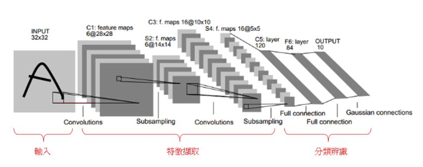
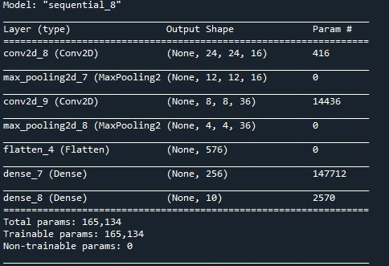
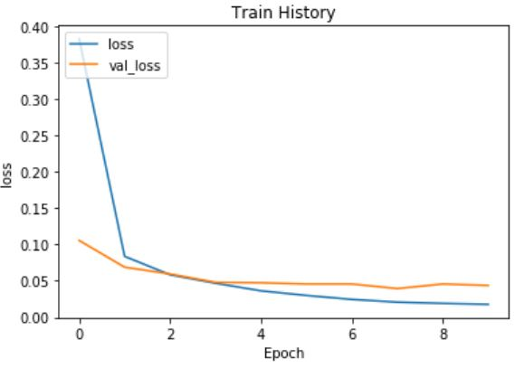

# Keras_MLP_model

CNN的作用是簡化Neural Network的架構，用Prior Knowledge把Fully Connected Layer的參數簡化。

 
## CNN Property
1. Some patterns are much smaller than the whole image.

2. The same patterns appear in different regions.

3. Subsampling the pixels will not change the object.

## Convolution
* Convolution裡有很多filter，每個filter作用為偵測Image裡與此filter相符的pattern。[Property1]
* Filter與Image做內積，並且不斷向右、下移動1個距離(取決於stride)，將會得到一個matrix。這個matrix若有最大值，代表filter要偵測的pattern在那個位置。[Property2]

## Max Pooling
* 取一個適當大小為一個組別，並將裡面的值做平均獲取最大值讓Image縮小。此動作能將Image縮小又不會影響其圖片特徵，減少參數。[Property3]

## Model架構如下

## loss 與 validation loss關係如下圖

